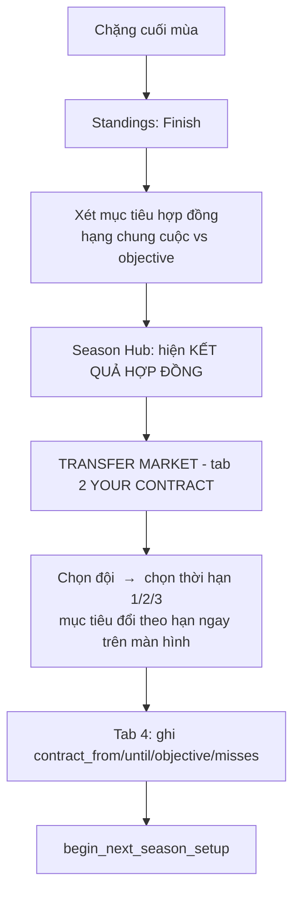

# Hợp đồng tay đua — Thiết kế

> **Trạng thái: đã code xong toàn bộ.** Cùng quy ước với `transfer_market.md`:
> chốt flow và từng hằng số trước, kiểm chứng bằng mô phỏng, rồi mới code — nên
> tài liệu này đọc theo thứ tự đã diễn ra, kể cả những phương án đã thử rồi bỏ.
> Kiểm chứng bằng `python test_transfers.py`; script đo ở `tools/contracts/`.
>
> Các mục **"Cái đã có sẵn"** và **"Mô hình dữ liệu"** mô tả trạng thái *trước*
> khi làm, nên vài tham chiếu dòng trong đó đã lệch so với code hiện tại. Phần
> `transfer_flow.docx` ở cuối là bản chốt cuối cùng và nó **thay thế** hệ xác
> suất 95/80/60/20 mô tả ở giữa tài liệu.

Hợp đồng biến kỳ chuyển nhượng từ *"chọn đội nào"* thành *"chọn đội nào, với điều
kiện gì"*. Mỗi offer có **thời hạn** người chơi chọn và **mục tiêu thành tích**
đội đặt ra; đạt thì giữ ghế, không đạt thì hết hạn là mất.

**Không có tiền.** Lương / ngân sách / tiền thưởng vẫn nằm ngoài phạm vi, đúng
như `transfer_market.md` đã chốt. Đàm phán vẫn một vòng, vẫn chỉ diễn ra ở
off-season.

## Phạm vi

| Có làm | Không làm |
|---|---|
| Người chơi chọn thời hạn **1 hoặc 2 năm** | Lương, ngân sách, tiền thưởng |
| Mỗi offer có mục tiêu = một vị trí cụ thể | Đàm phán nhiều vòng, mặc cả |
| Xét mục tiêu cuối mỗi mùa, cảnh báo giữa hạn | Gia hạn giữa mùa (chỉ off-season) |
| Không đạt ở năm cuối ⇒ đội không giữ | Điều khoản phá vỡ, điều khoản giải phóng |
| Hiển thị hạn hợp đồng của cả 24 tay đua | Mục tiêu **hiện ra** cho tay đua AI |
| **AI gia hạn theo thành tích, cả 24 ghế** | |

## Cái đã có sẵn

`contract_until` **đã tồn tại** và đã chạy đúng, chỉ là vô hình:

- `sign()` roll ngẫu nhiên 1–2 năm ([src/transfers.py:354](src/transfers.py#L354)),
  `CONTRACT_LENGTHS = (1, 2)`.
- `out_of_contract()` ([src/transfers.py:338](src/transfers.py#L338)) là **cái phanh
  churn**: chỉ người hết hạn mới bị loại hoặc bị chiêu mộ. Nhờ nó mà tân binh giữ
  ở 1.85/mùa và pool 100 người đủ ~54 mùa.
- Người chơi không thấy gì cả. Comment trong code nói thẳng: *"the seeded rng only
  picks a contract length, which this tab doesn't show"*
  ([p_transfers.py:473](app/pages/p_transfers.py#L473)).

Nên thiết kế này **không dựng cơ chế mới từ đầu** — nó phơi cơ chế đã tuned ra
thành điều khoản người chơi đọc được và chọn được.

## Vấn đề cốt lõi: mục tiêu phải tính cả tay đua, không chỉ chiếc xe

Ý tưởng đầu tiên là dùng luôn `expected_rank()` — hạng mà chiếc xe đáng được — vì
`DROP_EFFICIENCY = -3.0` sẵn có đã đúng là *"thua hạng kỳ vọng của xe 3 bậc thì
mất ghế"*. Mục tiêu chỉ là quy tắc đó viết ra thành chữ.

**Đo thử thì hỏng ngay.** Mô phỏng 60 career × 25 mùa với mục tiêu
`expected_rank + slack`, tỉ lệ đạt theo năm sự nghiệp:

| Năm sự nghiệp | 1 | 2 | 3 | 4 | 5 | 6 | 7 |
|---|:-:|:-:|:-:|:-:|:-:|:-:|:-:|
| Chỉ số | 62.5 | 68.6 | 73.8 | 76.5 | 79.1 | 81.6 | 82.6 |
| **Đạt mục tiêu** | 20% | **0%** | 15% | 42% | 70% | 88% | 77% |

Năm thứ hai **không một career nào đạt**. Lý do đơn giản: `expected_rank` hỏi
*"chiếc xe này đáng về hạng bao nhiêu"*, và với lưới AI (ai cũng ~84) thì đó là
câu hỏi đúng — nhưng người chơi là **tay đua duy nhất dưới 84** trong 5 năm đầu.
Một tân binh 62 điểm trên xe Storm Riders về P24; đòi họ đạt "P18 trở lên" là mục
tiêu không thể đạt **về mặt thiết kế**, không phải vì họ đua kém.

Đây cũng là điểm mù của chính `DROP_EFFICIENCY` hiện tại — nó bị che đi vì lưới
AI đồng đều, người chơi thì không.

### Baseline có tính chỉ số

Đo bằng chính `engine.perf_score_race`: cho tay đua chỉ số R ngồi xe của từng
đội, chạy 400 mùa, lấy **hạng trung vị**. Đây là bảng đo thật, không phải suy diễn
(script: `tools/contracts/contract_targets.py`):

| Chỉ số \ đội | 1 Duc | 2 Suz | 3 Kaw | 4 Raz | 5 Yam | 6 Hon | 7 BMW | 8 Sto | 9 Inf | 10 Fal | 11 Tri | 12 Pho |
|---|:-:|:-:|:-:|:-:|:-:|:-:|:-:|:-:|:-:|:-:|:-:|:-:|
| 62 | 20 | 22 | 23 | 23 | 23 | 24 | 24 | 24 | 24 | 24 | 24 | 24 |
| 67 | 17 | 19 | 21 | 21 | 21 | 23 | 23 | 24 | 24 | 24 | 24 | 24 |
| 73 | 11 | 15 | 16 | 17 | 17 | 20 | 20 | 22 | 23 | 24 | 24 | 24 |
| 78 | 8 | 10 | 12 | 12 | 13 | 16 | 16 | 18 | 20 | 21 | 23 | 24 |
| 82 | 4 | 8 | 9 | 9 | 10 | 12 | 13 | 15 | 18 | 18 | 20 | 24 |
| **84.5** | **2** | **6** | **7** | **7** | **8** | **11** | **11** | **13** | **16** | **16** | **19** | **22** |
| 86.5 | 1 | 4 | 6 | 6 | 7 | 9 | 10 | 11 | 14 | 15 | 16 | 21 |
| 88 | 1 | 3 | 4 | 5 | 5 | 9 | 9 | 10 | 13 | 13 | 16 | 20 |
| 89.5 | 1 | 2 | 3 | 3 | 4 | 7 | 8 | 9 | 12 | 11 | 14 | 19 |
| 91 | 1 | 2 | 3 | 3 | 3 | 6 | 6 | 8 | 11 | 11 | 13 | 18 |
| 93 | 1 | 1 | 2 | 2 | 2 | 4 | 5 | 6 | 9 | 9 | 11 | 16 |
| 95 | 1 | 1 | 1 | 2 | 1 | 3 | 3 | 5 | 8 | 8 | 9 | 15 |

> **Ba hàng cuối thêm vào lúc code (GĐ 2), không có trong bản thiết kế gốc.** Lưới
> AI dừng ở 89.5 nên ban đầu bảng cũng dừng ở đó — nhưng **người chơi đi qua mốc
> đó**, đúng theo vòng lặp XP ở cuối tài liệu này: về đích top đầu đủ lâu là chạm
> trần 95.0. Nếu bảng kẹp ở 89.5 thì từ mốc đó trở đi hợp đồng **thôi đòi hỏi gì
> thêm** — nhà vô địch 95 điểm ở Phoenix vẫn chỉ bị đòi P19 thay vì P15. Đây là
> hệ quả trực tiếp của lỗ cân bằng chưa sửa, và là ví dụ cho thấy nó rò sang các
> hệ khác.

Hàng 62 là chỉ số một custom rider ở mùa đầu (`CUSTOM_START` = 60 cho cả 5 chỉ số
tăng trưởng); dưới mức đó không cần đo vì mọi ô đã chạm đáy bảng.

Hàng **84.5** là phần kiểm chứng đáng giá nhất: nó gần như trùng khít
`expected_rank` của cả 12 đội (1.5 / 3.5 / 5.5 / 7.5 / 9.5 / 11.5 / 13.5 / 15.5 /
17.5 / 19.5 / 21.5 / 23.5). Tức là **`expected_rank` là baseline đã hiệu chỉnh
đúng — cho một tay đua tầm trung vị lưới.** Bảng trên chỉ mở rộng nó ra các mức
chỉ số khác, chứ không thay thế nó.

**Dùng bảng đo, không dùng công thức hồi quy.** Fit tuyến tính
`hạng = 53.18 + 0.621·expected_rank − 0.587·chỉ_số` cho R² = 0.932, sai số trung
bình 1.4 bậc — nghe ổn, nhưng **sai số cực đại 7.4 bậc** và nằm đúng ở góc quan
trọng nhất: tay đua giỏi trên xe mạnh. Fit đoán Ducati + 84.5 → P4.5 trong khi đo
thật là P2, nên mục tiêu 3 năm ở Ducati hoá ra là P5 thay vì P2 — mất hẳn áp lực ở
đúng chiếc xe mà áp lực đáng lẽ phải lớn nhất. Hạng bị chặn
ở P1 nên quan hệ không tuyến tính ở đó. Tra bảng thì đúng ở mọi ô, và cũng dễ debug
hơn một công thức ba hằng số.

Chênh lệch đó đủ để đổi cả `SLACK`: hiệu chỉnh trên fit ra `+3/+2/+1`, còn trên
bảng đo thì cùng thang rủi ro ấy cần `+2/+1/+0`. Mọi số ở dưới là bộ chạy trên
bảng đo.

## Mô hình dữ liệu

Thêm vào bản ghi tay đua trong `roster.json` / `rider.json`:

```jsonc
{
  "contract_until": 2028,      // ĐÃ CÓ: mùa cuối được bảo vệ
  "contract_from": 2026,       // MỚI: mùa đã ký — để hiện "năm 2 / 3"
  "objective": 8,              // MỚI: về P8 trở lên; null = "hoàn thành mùa giải"
  "misses": 1                  // MỚI: số mùa không đạt trong hợp đồng này
}
```

`objective` / `misses` **chỉ người chơi có** — vì chỉ người chơi mới *chọn* điều
khoản. Tay đua AI không cần thêm field nào: roll gia hạn đọc `efficiency` tính
tại chỗ trong off-season, không lưu gì.

## Gia hạn của AI

Mùa **2026 mọi tay đua đều có hợp đồng 1 năm** (`build_initial_roster` hiện roll
ngẫu nhiên 1–2 năm, [wizard.py:808](app/wizard.py#L808) — đổi thành
`contract_until = year`). Nên off-season đầu tiên là một kỳ xáo trộn thật, không
phải một phần tư lưới nhỏ giọt.

Từ đó trở đi, **mọi off-season**, ai hết hạn thì đội quyết có đi tiếp không. Chỉ
**một lằn ranh duy nhất**, trên thang `efficiency` mà thị trường vẫn dùng:

| Thành tích mùa vừa rồi | Xác suất được giữ |
|---|:-:|
| Đạt kỳ vọng, **kể cả kém một chút** (`eff > −3.0`) | **95%** |
| Không đáp ứng kỳ vọng (`eff ≤ −3.0`) | **10%** |

Không phân biệt factory / satellite. Không thang trượt theo mức giỏi.

> **Đây là bản thay thế cho hệ 95/80/60/20% trước đó**, theo `transfer_flow.docx`.
> File đó viết kết quả tất định ("đáp ứng kỳ vọng → kí tiếp 2 năm", "không đáp ứng
> → không được gia hạn"), và bạn chốt giữ lại một chút may rủi ở hai đầu — nên
> 95% và 10% thay vì 100% và 0%. Một kỳ chuyển nhượng không có bất ngờ nào thì
> đọc như bảng tính, không như silly season.

**Điểm quan trọng nhất của hình dạng này: đua giỏi không mua được ghế *chắc hơn*,
mà mua được ghế *tốt hơn*.** Người vừa đủ qua ngưỡng và người kéo Phoenix vào top
điểm có cùng 95% được giữ. Khác biệt nằm ở chỗ người thứ hai mở được đường **đi
lên** — promote lên factory cùng hãng, hoặc bị đội mạnh hơn chiêu mộ.

Nên tầng "vượt xa kỳ vọng" trong `transfer_flow.docx` **không cần hằng số riêng**:
nó chính là hai cửa mà một vụ chuyển lên vốn đã phải qua — `PROMOTE_MARGIN` (3.0)
để được đôn lên factory, và `hire_bar` để được chiêu mộ.

### Hạn hợp đồng do đường vào quyết định

```python
RENEW_YEARS   = 2    # đội cũ giữ lại
PROMOTE_YEARS = 2    # được đôn từ satellite lên factory cùng hãng
ROOKIE_YEARS  = 2    # tân binh gọi từ pool
MOVE_YEARS    = 1    # hết hạn rồi ký với đội MỚI
```

Ở lại, được đôn lên, hay ra mắt đều được hai mùa. Còn ký với đội mới sau khi bị
thả thì chỉ một mùa — phải chứng minh lại ngay. `sign()` giờ **bắt buộc nhận thời
hạn**, không còn roll ngẫu nhiên 1–2 năm như trước.

**Không gia hạn ⇒ mất ghế thật**, rồi đi tiếp bằng đúng đường salvage đã có
([src/transfers.py:616](src/transfers.py#L616)): họ chỉ ký được với đội **yếu hơn**
đội vừa thải, và phải còn đủ `salvage_appeal`. Ai không ai lấy thì rời giải.

### Tụt xa bao nhiêu thì do tuổi quyết định

Người còn nhiều năm phía trước tụt xuống đội **gần tương đương**; người đã lớn
tuổi tụt **xuống hẳn phía dưới**. Không phải rào cứng mà là **ưu tiên**:

```
chịu tụt được = 3.0 + 2.5 × (tuổi − 28, nếu dương)     # điểm power
điểm chọn      = salvage_appeal − 3.0 × (phần tụt vượt mức chịu được)
```

Hàng đợi ghế trống duyệt theo power giảm dần, nên đội mạnh còn ghế nhắm người trẻ
trước, còn các đội yếu phía dưới thấy người trẻ "không đáng" và lấy người lớn tuổi.
Từ 35 tuổi thì mức chịu được vượt cả dải power của lưới (19.6) — tức là không còn
giới hạn.

**Phải là ưu tiên, không được là rào.** Nếu chặn cứng người trẻ khỏi các ghế yếu
hơn nhiều, thì mùa nào không có ghế tương đương là họ **rời giải hẳn** — ngược
hoàn toàn ý đồ, vì người phải hết đường mới là các veteran. Nên một đội yếu chỉ có
đúng một ứng viên trẻ thì vẫn ký.

Đo trên 30 career × 20 mùa (`tools/contracts/salvage_age.py`):

| Tuổi | Trước — tụt trung vị | Sau |
|---|:-:|:-:|
| ≤ 25 | 5.0 | **3.6** |
| 26–28 | 5.0 | 4.2 |
| 29–31 | 5.0 | 5.4 |
| 32+ | 5.0 | **5.2** |

Trước đó `salvage` rank theo `efficiency` nên tuổi **không hề** ảnh hưởng tới điểm
đến — cả bốn nhóm đều tụt trung vị đúng 5.0.

> **Dùng trung vị, không dùng trung bình.** Cả bốn nhóm vẫn giữ đuôi dài tới 19.6
> (toàn bộ dải power), chính vì đây là ưu tiên chứ không phải rào — hết ghế gần thì
> một tay đua 23 tuổi vẫn nhận ghế đáy. Trung bình bị cái đuôi đó kéo nên gần như
> không tách nhóm (5.2 so với 6.3); trung vị mới nói đúng chuyện gì thường xảy ra.

> **Hệ quả: tay đua Phoenix Motorsport không gia hạn là rời giải, luôn luôn.**
> Salvage đòi một đội *yếu hơn* đội vừa thải, mà Phoenix đã là yếu nhất — nên
> không có chỗ nào để tụt xuống. Ghế ở đội bét bảng vì thế khắc nghiệt nhất giải:
> 95% được giữ, còn 5% là hết sự nghiệp, kể cả khi vượt kỳ vọng (quan sát được
> một ca `+4.5 vs the bike` vẫn rời giải). Đúng logic, đã nằm trong con số tân
> binh/mùa, ghi lại vì nó **không** hiển nhiên khi đọc luật.

### Đội mạnh bốc được tân binh tốt hơn hẳn

`transfer_flow.docx` yêu cầu mean của phân phối bốc tân binh ở đội mạnh phải lớn
hơn — "thậm chí là lớn hơn hẳn". `ROOKIE_SHIFT` tăng **1.5 → 2.5**:

| Đội | Power | Mục tiêu cũ | **Mục tiêu mới** |
|---|:-:|:-:|:-:|
| Ducati Factory Racing | 91.8 | 85.6 | **87.1** |
| Razor Racing | 86.8 | 84.3 | 84.9 |
| BMW Factory Racing | 83.6 | 83.4 | 83.5 |
| Triumph Factory Racing | 77.2 | 81.8 | 80.7 |
| Phoenix Motorsport | 72.2 | 80.5 | **78.5** |

Đo trên 600 lượt bốc mỗi mức:

| | SHIFT 1.5 | SHIFT 2.5 |
|---|:-:|:-:|
| Tương quan **lúc bốc** | +0.44 | **+0.63** |
| Top-3 bốc trung bình | 85.2 | **86.2** |
| Đáy bảng bốc trung bình | 81.5 | **80.3** |
| Chênh | +3.7 | **+6.0** |

> **Đừng lẫn hai con số tương quan.** Bảng cân bằng báo tương quan xe↔người
> **toàn lưới** chỉ 0.39, và nó gần như không đổi khi tăng SHIFT (0.35 → 0.40).
> Lý do: tân binh chỉ chiếm ~2 trong 24 ghế mỗi mùa, phần còn lại vào lưới qua
> promote/chiêu mộ/nhặt người — nên hiệu ứng bị pha loãng. `ROOKIE_SHIFT` tác động
> đúng chỗ nó phải tác động (0.44 → 0.63); toàn lưới thì không.
>
> Cũng vì thế nó **không** đẩy tương quan lưới lên vùng 0.7+ mà
> `transfer_market.md` cảnh báo là "chức vô địch được quyết ở kỳ chuyển nhượng".
> SHIFT chỉ góp 0.27 điểm vào việc median lưới tụt (82.61 ở 1.5 so với 82.34 ở
> 2.5) — phần còn lại do luật gia hạn tất định làm giảm churn.

> ### ⚠ Thứ tự đóng dấu hợp đồng — chỗ dễ hỏng nhất
>
> Roll gia hạn ở bước 3 **chỉ được quyết ai giữ ghế, tuyệt đối không đóng dấu
> `contract_until` ngay tại đó.** Việc đóng dấu phải để đến bước 7, đúng như engine
> hiện tại đang làm.
>
> Lý do: bước 5a (factory promote từ satellite cùng hãng) và 5b (chiêu mộ từ đội
> yếu hơn) đều lọc ứng viên bằng `out_of_contract(r, year)`. Nếu bước 3 gia hạn
> xong đóng dấu luôn thì **không còn ai hết hạn**, và cả hai cơ chế đó chết im
> lặng — không báo lỗi, chỉ đơn giản là không bao giờ chạy.
>
> Tôi đã cài sai đúng chỗ này trong bản đo đầu tiên. Hậu quả đo được:
>
> | | Cài sai | Cài đúng |
> |---|:-:|:-:|
> | Tổng số vụ ký | 3.260 | **8.412** |
> | Vụ chiêu mộ / promote | **0** | 5.100 |
> | `eff` trung bình đội top-3 ký về | **−3.39** | **+4.02** |
> | Tân binh/mùa | 2.37 | 2.23 |
>
> Nghĩa là 60% thị trường không hoạt động, và các đội mạnh toàn nhặt hàng thải —
> **ngược hẳn** luật mong muốn. Ranh giới đúng: roll gia hạn trả lời *"đội có muốn
> giữ không"*, còn promote/chiêu mộ trả lời *"có ai khác muốn hơn không"*. Cả hai
> phải cùng chạy trên tập người đã hết hạn.

### Đội mạnh nhắm người vượt kỳ vọng, đội yếu nhận hàng thải

Phần này **đã có sẵn trong engine**, không phải viết mới. `hire_bar()`
([src/transfers.py:195](src/transfers.py#L195)) cho ngưỡng `eff` tỉ lệ thuận với
sức mạnh xe, và hàng đợi lấp ghế duyệt theo **power giảm dần** nên đội mạnh chọn
trước:

| Đội | Power | Ngưỡng `eff` đòi hỏi |
|---|:-:|:-:|
| Ducati Factory Racing | 91.8 | **+2.0** |
| Kawasaki Factory Racing | 89.0 | +1.3 |
| Yamaha Factory Racing | 86.4 | +0.5 |
| BMW Factory Racing | 83.6 | −0.2 |
| Falcon Racing | 78.6 | −1.3 |
| Phoenix Motorsport | 72.2 | **−2.0** |

Đo trên 8.412 vụ ký để chắc là luật gia hạn mới
không phá hành vi này:

| Đội đi ký | Số vụ | `eff` trung bình | % vượt kỳ vọng |
|---|:-:|:-:|:-:|
| Top 3 (Ducati/Suzuki/Kawasaki) | 1.675 | **+4.02** | **93%** |
| Giữa (Razor…BMW) | 2.768 | +0.92 | 70% |
| Đáy (Storm…Phoenix) | 3.969 | **−1.26** | **32%** |

Tách theo cách lấp ghế thì càng rõ — đội mạnh **chiêu mộ** người giỏi, còn hàng
thải chảy xuống dưới:

| Đội đi ký | Chiêu mộ / promote | Nhặt người vừa mất ghế |
|---|:-:|:-:|
| Top 3 | **+4.53** | −2.60 |
| Giữa | +2.64 | −3.04 |
| Đáy | +0.86 | −2.25 |

### Đây là thay đổi lớn nhất của cả thiết kế

Bước 3 hiện tại chỉ loại người **factory**, **hết hạn**, `eff ≤ −3.0`, **và** thua
đồng đội — bốn điều kiện cùng lúc. Luật mới roll cho **cả 24 ghế**.
`transfer_market.md` dòng 334–336 đã đo đúng phương án "áp cho cả 24 ghế" và kết
luận nó hỏng: **3.0 tân binh/mùa, pool cạn ở mùa 34.**

Nhưng luật ở đây khác ở chỗ **xác suất chứ không tất định**: một mùa tệ là 20% mất
ghế, không phải chắc chắn. Đo lại (30 career × 40 mùa,
`python test_transfers.py`):

| | Luật gốc | Bản 95/80/60/20 | **Theo transfer_flow** |
|---|:-:|:-:|:-:|
| Mất ghế/mùa | 1.24 | 3.44 | **2.68** (76% tụt xuống đội yếu) |
| Tân binh/mùa | 1.85 | 2.14 | **1.96** → pool đủ **51 mùa** |
| Median lưới | 82.4 | 83.1 | **82.3** |
| Tuổi trung bình | 27.1 | 26.9 | **26.9** |
| Dưới 30 trụ lại | 97% | 88% | **91%** |

*(Đo từ engine thật — `python test_transfers.py`, 40 career × 25 mùa.)*

Luật tất định **giảm** churn so với bản xác suất, vì tầng giữa (`−3 < eff < −0.5`)
trước đây chỉ được giữ 60% thì giờ được giữ 95%. Pool quay về đủ 51 mùa.

**Median lưới không trôi.** Đây là chỗ đáng lo nhất khi churn giảm, nên tôi đo
riêng 20 career × 40 mùa: chạm đáy **81.9** quanh mùa 10–15 rồi hồi lên **83.8** ở
mùa 40 — trôi **+0.36** giữa 10 mùa đầu và 10 mùa cuối. Đáy ở giữa là lưới CSV gốc
(median 83.8) hoà dần về median của pool (83.4), đúng như thiết kế. Người mạnh nhất
lưới luôn ≥ 88 nên người chơi luôn có đối thủ thật.

Off-season đầu tiên — cái wave mà bullet 1 tạo ra:

| | Trung bình | Biên |
|---|:-:|:-:|
| Được gia hạn | 16.1 / 24 | 12–21 |
| Mất ghế | **7.5** | 3–12 |
| Thực sự rời giải | **1.2** | 0–3 |
| Tân binh gọi lên | **1.6** | 0–3 |

Đây là kết quả đáng giá nhất: **7.5 người mất ghế nhưng chỉ 1.2 người rời giải.**
Đường salvage hấp thụ gần hết cái wave — họ tụt xuống đội yếu hơn chứ không biến
mất. Đúng cái cảm giác bullet 5 mô tả, và nó có sẵn rồi, không phải viết mới.

> **Cái giá:** pool tụt từ 54 xuống 45 mùa, và 2.23 chạm sát ngưỡng ≤ 2.2 mà
> `transfer_market.md` đặt ra. Chấp nhận được — 45 mùa dài hơn mọi career thực tế
> (người chơi đi 15–25 mùa là nhiều) — nhưng nó **ăn hết phần dư an toàn**, và là
> hệ quả trực tiếp của việc mở roll gia hạn ra cho cả ghế satellite. Muốn lấy lại
> tuổi thọ pool thì cần gạt là `SALVAGE_BAR` (hạ xuống ⇒ nhiều người trụ lại ⇒ ít
> tân binh hơn).

### Thời hạn gia hạn: cố định 2 năm — và nhịp sóng đi kèm

**Đã chốt: gia hạn luôn là `+2` năm, áp dụng mọi off-season.**

Vì bullet 1 cho cả lưới hết hạn cùng lúc ở 2026, `+2` cố định về lý thuyết sẽ giữ
nguyên nhịp đó mãi: nhóm nào gia hạn cùng nhau thì 2 năm sau cùng hết hạn. Số ghế
mất theo mùa quả thật có dao động:

| Cuối mùa | 2026 | 2027 | 2028 | 2029 | 2030 | 2031 |
|---|:-:|:-:|:-:|:-:|:-:|:-:|
| Số ghế mất | **7.5** | 1.9 | **5.8** | 3.6 | **5.0** | 3.6 |

Nhưng nó **tự tắt dần**, và lý do nằm ở chỗ ban đầu tôi tưởng không liên quan:
người chuyển đội đi qua `sign()`, vốn roll hạn **1–2 năm ngẫu nhiên**. Mỗi vụ
chiêu mộ hay promote vì thế tách một người ra khỏi cohort. Với ~5.100 vụ như vậy
trong 40 mùa, các kỳ hết hạn tự rải ra.

Đo lại ba phương án sau khi đã sửa lỗi thứ tự đóng dấu (
**wave** = biên độ dao động sau khi cohort đầu trôi qua):

| Thời hạn gia hạn | Tân binh/mùa | Pool đủ | Wave | Median | Tuổi |
|---|:-:|:-:|:-:|:-:|:-:|
| **Cố định 2 năm — đã chọn** | **2.23** | **45 mùa** | **1.4** | **83.2** | **26.7** |
| Ngẫu nhiên 2–3 năm | 2.17 | 46 mùa | 1.3 | 83.1 | 26.8 |
| Theo băng thành tích | 2.23 | 45 mùa | 1.6 | 83.2 | 26.7 |

**Cố định 2 năm giờ ngang ngửa phương án ngẫu nhiên** (1.4 so với 1.3). Con số 2.4
đáng lo mà tôi báo trước đó là hệ quả của chính lỗi thứ tự đóng dấu ở trên: khi
chiêu mộ chết thì không còn gì rải cohort ra cả. Sửa lỗi đó xong thì lựa chọn giữ
`+2` gần như không tốn gì — nên đây không còn là điểm đánh đổi nữa.

Ghi lại vì nó là bài học chung: nhịp sóng và cơ chế chiêu mộ **nối với nhau qua
`sign()`**, chuyện không nhìn ra được từ thiết kế trên giấy.

## Mục tiêu và thời hạn

```
cột      = đội (12 đội, tra thẳng — không nội suy)
baseline = nội suy tuyến tính theo chỉ số người chơi trên cột đó
           ngoài dải 62..89.5 thì kẹp về hàng gần nhất, không ngoại suy
mục tiêu = round(baseline + SLACK[thời hạn])
mục tiêu ≥ 24  →  không đặt mục tiêu, chỉ "hoàn thành mùa giải"
```

Kẹp thay vì ngoại suy vì hai đầu dải đều đã sát biên: dưới 62 thì mọi ô đã chạm
P24, trên 89.5 thì cột đầu đã chạm P1 — ngoại suy ở đó chỉ bịa ra độ chính xác
không có thật.

```python
OBJECTIVE_SLACK = {1: +2.0, 2: 0.0}   # chỉ ký 1 hoặc 2 năm
```

**Chỉ có 1 và 2 năm**, vì đua xe thực tế gần như chỉ ký vậy. Ban đầu thiết kế có
cả mốc 3 năm; bỏ nó đi lại **bắt buộc phải giãn hai mốc còn lại ra**, xem bên dưới.

Baseline là *trung vị*, nên slack là **mức ân hạn** đội cho thêm. Hợp đồng 2 năm
có slack **bằng 0**: đội đòi đúng cái mà một tay đua tầm đó trên chiếc xe đó phải
làm được — không hơn, nhưng cũng không tha. Hạn 1 năm được cho thêm 2 bậc.

Hiệu chỉnh trên 600 mùa × 12 mức chỉ số × 12 đội, gọi thẳng `baseline_finish()`
của engine nên tool không thể lệch khỏi game
(script: `tools/contracts/term_slack.py`):

| Slack | Tỉ lệ đạt |
|:-:|:-:|
| −1 | 30% |
| **+0** | **69%** |
| +1 | 89% |
| **+2** | **97%** |
| +3 | 100% |

### Vì sao bỏ mốc 3 năm lại phải đổi cả hai mốc kia

Thang cũ là 97% / 89% / 69%, và **mốc 3 năm là mốc duy nhất có rủi ro thật**. Bỏ
nó mà giữ nguyên slack thì còn 97% và 89% — chênh 8 điểm, tức là ký 2 năm gần như
miễn phí, và như vậy thì không còn là quyết định nữa. Các phương án:

| Thang | Tỉ lệ đạt | Chênh |
|---|:-:|:-:|
| 1 năm +2 / 2 năm +1 | 97% / 89% | 8 điểm — quá nhạt |
| **1 năm +2 / 2 năm +0** | **97% / 69%** | **28 điểm** |
| 1 năm +3 / 2 năm +0 | 100% / 69% | 31 điểm — nhưng 1 năm thành vô nghĩa |

Chọn **+2 / +0**: hạn 1 năm gần như chắc đạt nhưng năm nào cũng bị đánh giá; hạn
2 năm đòi đúng par nhưng mua được một mùa không thể mất ghế.

Và điều quan trọng nhất — **tỉ lệ đạt đứng yên qua toàn bộ sự nghiệp**, đúng chỗ
phương án chỉ-dựa-vào-xe thất bại:

| Chỉ số | 62 | 73 | 82 | 84.5 | 88 | 89.5 | 93 | 95 | **chung** |
|---|:-:|:-:|:-:|:-:|:-:|:-:|:-:|:-:|:-:|
| 1 năm | 100% | 99% | 97% | 96% | 96% | 94% | 97% | 98% | **97%** |
| 2 năm | 83% | 78% | 67% | 63% | 63% | 56% | 64% | 69% | **69%** |

Tân binh 62 điểm và nhà vô địch 95 điểm chịu **cùng một thang rủi ro**. Không có
bậc nào của sự nghiệp bị hệ mục tiêu trừng phạt oan — đó là toàn bộ lý do phải đổi
sang baseline có tính chỉ số.

Độ dốc nhẹ theo chỉ số (2 năm: 83% ở mức 62, 56% ở mức 89.5) là **hệ quả của việc
hạng bị chặn ở P1**: nhà vô địch trên Ducati có par P1, hợp đồng 2 năm đòi đúng
P1 — hợp đồng vô địch-hoặc-thất-bại. Đúng ý đồ, và chỉ chạm tới người đã ở đỉnh.

Mục tiêu người chơi 84.5 điểm sẽ thấy trên bảng offer:

| Đội | par | 1 năm | 2 năm |
|---|:-:|:-:|:-:|
| Ducati Factory Racing | 2 | P4 | **P2** |
| Suzuki Factory Racing | 6 | P8 | P6 |
| Kawasaki Factory Racing | 7 | P9 | P7 |
| Razor Racing | 7 | P9 | P7 |
| Yamaha Factory Racing | 8 | P10 | P8 |
| Honda Factory Racing | 11 | P13 | P11 |
| BMW Factory Racing | 11 | P13 | P11 |
| Storm Riders | 13 | P15 | P13 |
| Inferno Factory | 16 | P18 | P16 |
| Falcon Racing | 16 | P18 | P16 |
| Triumph Factory Racing | 19 | P21 | P19 |
| Phoenix Motorsport | 22 | hoàn thành | P22 |

### Vì sao hạn dài lại khó hơn

Đánh đổi phải có hai chiều, nếu không thì luôn có một lựa chọn đúng:

- **1 năm** — mục tiêu dễ (97% đạt), nhưng off-season nào cũng ra thị trường.
  Được: thấy xe tốt hơn là nhảy ngay. Mất: năm nào cũng là năm bị đánh giá.
- **2 năm** — một mùa **không thể mất ghế** (cơ chế bảo vệ hợp đồng đã có, không
  cần thêm gì), nhưng đội đòi đúng par (69% đạt) và bị khoá khỏi offer tốt hơn.

Cái làm quyết định này thú vị là **nó đổi nghĩa theo thời gian**: 5 năm đầu chỉ số
tăng vọt (60 → 82.5) nên khoá 2 năm là bỏ mất một nấc thang leo lên; từ năm 6 trở
đi `W1 = 0` nên tăng trưởng gần như phẳng, khoá 2 năm gần như miễn phí. Cùng một
lựa chọn, đầu sự nghiệp là sai còn cuối sự nghiệp là đúng.

## Xét mục tiêu

Cuối mỗi mùa, so hạng chung cuộc với `objective`:

| Tình huống | Hệ quả |
|---|---|
| Đạt | Không gì. Đạt ở **năm cuối** → đội hiện tại chắc chắn có offer mới |
| Không đạt ở **năm đầu** của hợp đồng 2 năm | `misses += 1`, hiện cảnh báo. Ghế vẫn an toàn |
| Không đạt ở **năm cuối** | Đội không giữ — đúng đường `player_dropped` đã có |

> **Bỏ luật huỷ sớm.** Thiết kế ban đầu có thêm dòng *"trượt mọi mùa của hợp đồng
> ⇒ huỷ ngay"*, làm van xả cho ca ký hớ nặng, nhắm tần suất ~2%. Với hạn tối đa
> 2 năm và slack 0 (69% đạt), xác suất trượt cả hai mùa vọt lên **12.4%** — cứ 8
> hợp đồng thì 1 cái bị huỷ, không còn là van xả mà thành luật thường trực.
>
> Và giá trị của nó cũng biến mất: khi hạn dài nhất chỉ là 2 năm, huỷ sớm tiết
> kiệm cho người chơi đúng **một mùa**. Không đáng để thêm một đường code, một
> trạng thái lưu, và một khái niệm nữa cho người chơi phải hiểu. Luật "trượt ở năm
> cuối thì mất ghế" đã đủ.
>
> Đây là hệ quả trực tiếp của việc bỏ mốc 3 năm — luật huỷ sớm vốn được thiết kế
> cho tình huống bị khoá thêm *hai* mùa tệ nữa.

### Còn hạn thì biến mất khỏi thị trường

Đây là thay đổi hành vi lớn nhất của GĐ 3, và nó **chưa có trong bản thiết kế
gốc**. Trước đây `_player_market` chào offer từ mọi đội đạt `hire_bar`, **bất kể
người chơi còn hợp đồng hay không** — nên thực tế người chơi nhảy đội được mỗi
mùa và `contract_until` của họ chẳng có tác dụng gì.

Giờ nếu chưa tới năm cuối thì offer duy nhất là **cái ghế đang ngồi**. Đó chính là
thứ hợp đồng 2 năm mua được, và cũng là cái giá của nó: mùa đông đó có xe ngon
hơn trống ra cũng không tới lượt.

> **UI đã xử lý ở GĐ 4.** Tab hiện tiêu đề *"UNDER CONTRACT WITH X THROUGH Y —
> NOTHING TO DECIDE"*, dòng offer duy nhất hiển thị **hợp đồng đang chạy**
> (`THROUGH 2028 · target P8`) chứ không phải điều khoản của một hợp đồng mới,
> và nó được tự ký sẵn để luồng đi tiếp. Phím bị vô hiệu hoá — không có gì để đổi.
>
> Bản đầu tôi code sai đúng chỗ này: dòng đó vẫn vẽ `‹ 1 YEAR › · target P9` như
> một offer mới, tức là thông báo sai điều khoản mà người chơi đang bị ràng buộc.
> Chỉ phát hiện được khi chụp màn hình ra xem.

Kèm theo đó, **phép so với đồng đội bị bỏ khỏi luật của người chơi**. Trước đây
người chơi bị sa thải khi `eff ≤ −3.0` **và** thua đồng đội. Giờ họ chỉ bị xét
đúng cái đã ký: trượt mục tiêu ở năm cuối là mất ghế. Tay đua AI vẫn không có
mục tiêu nên vẫn theo roll gia hạn — hai hệ tách bạch, đúng như đã chốt.

> **Không cho phép người chơi bị đẩy khỏi giải.** Luật hiện tại đã bảo đảm luôn có
> **ít nhất một offer từ đội yếu nhất** ([src/transfers.py:694](src/transfers.py#L694)).
> Thiết kế này giữ nguyên: hợp đồng có thể mất, sự nghiệp thì không.

## Flow

Chèn vào đúng phễu đã có, không thêm điểm lưu mới:



Bước C không cần disk mới: hạng chung cuộc đã nằm trong `history.json`, mục tiêu
nằm trong `rider.json`. Bất biến chống chạy hai lần vẫn là `roster.year ≥ Y` như cũ.

## UI

| Chỗ | Thêm gì |
|---|---|
| **Tab 2 YOUR CONTRACT** | Mỗi offer thêm cột CONTRACT; ▲▼ chọn đội, **Space** đổi hạn, mục tiêu đổi ngay theo hạn, Enter ký. Thêm dòng kết quả mục tiêu mùa vừa rồi ở đầu tab |
| **Your Profile / trang rider** | Dải hợp đồng dưới Basic Info: `CONTRACT through 2028 • target P8 • 1 season missed` |
| **NEXT SEASON GRID** | Badge mỗi tay đua: `under contract to 2028` (xám) hoặc `contract up this season` (vàng) |
| **Tab 1 DEPARTURES** | Cột phải đổi tên thành CONTRACT NOT RENEWED, rộng hơn, và **có scroll** |

> **Đổi chỗ so với thiết kế: không làm panel trên dashboard Season Hub.** Dashboard
> là layout ba cột đã tune rất kỹ — các panel canh đáy khớp nhau qua
> `_sync_upcoming_height` và một loạt comment giải thích từng con số. Chèn panel
> thứ tư vào đó là rủi ro lớn cho một thứ chỉ để nhắc.
>
> Thay vào đó dải hợp đồng nằm ở **Basic Info**, vốn được dùng chung cho cả Your
> Profile lẫn trang rider của Season Info — nên một chỗ sửa phục vụ luôn cả GĐ 5
> và GĐ 6. Ngay cả ở đây cũng không thêm được field row: hai cột trong đó canh
> nhau theo bước 73px (bánh xe phải ngang hàng BIKE NUMBER), nên dải hợp đồng đặt
> **dưới toàn bộ thân**, tốn chiều cao như nhau ở cả hai cột.
>
> Nếu sau này muốn nhắc ngay trên dashboard thì đó là việc riêng, phải tính cả
> phần canh lại layout.

Ba chỗ giữa là *lớp hiển thị* của `contract_until` đã có sẵn — rẻ, và nó làm kỳ
chuyển nhượng năm sau đọc được thay vì bất ngờ. Với luật gia hạn mới thì nó không
còn là trang trí: người chơi cần thấy ai sắp hết hạn để đoán được ghế nào sẽ mở.

## Phát hiện ngoài phạm vi: vòng lặp XP ↔ chiếc xe

Đo career trong lúc kiểm chứng thì lộ ra **một lỗ cân bằng có sẵn, không do hợp
đồng gây ra**, nhưng ảnh hưởng trực tiếp tới phần cân bằng mà `transfer_market.md`
đã khẳng định.

XP phụ thuộc **thứ hạng về đích** (`P_TIERS` / `EXP_TIERS` trong
`src/progression.py`). Nên xe tốt hơn → về cao hơn → nhiều XP hơn → chỉ số cao hơn
→ xe tốt hơn nữa. Đo chỉ số theo mùa khi giữ nguyên một thứ hạng:

| Về đích | Mùa 1 | 5 | 10 | 15 | 20 | 25 |
|---|:-:|:-:|:-:|:-:|:-:|:-:|
| P1 | 75.5 | **95.0** | 95.0 | 95.0 | 95.0 | 95.0 |
| P3 | 75.5 | **95.0** | 95.0 | 95.0 | 95.0 | 95.0 |
| P8 | 72.9 | 91.5 | **95.0** | 95.0 | 95.0 | 95.0 |
| P16 | 68.6 | 81.6 | 82.7 | 83.4 | 83.9 | **84.3** |
| P22 | 68.6 | 81.6 | 82.7 | 83.4 | 83.9 | **84.3** |

(script: `tools/contracts/fit_baseline.py`)

95.0 là trần thật: 5 chỉ số tăng trưởng chạm `STAT_CAP` 99, `wet_performance` đứng
ở 75 → `(5×99 + 75) / 6 = 95.0`.

Hệ quả trong career thật (60 career × 25 mùa, người chơi luôn chọn xe mạnh nhất
được mời — script: `tools/contracts/contract_career.py`):

| Năm | 1 | 5 | 7 | 10 | 15 | 20 | 25 |
|---|:-:|:-:|:-:|:-:|:-:|:-:|:-:|
| Chỉ số | 62.5 | 79.1 | 82.6 | 85.5 | 89.0 | 91.5 | **93.5** |
| Hạng | 24 | 16 | 7 | **1** | 1 | 1 | 1 |

**60/60 career lên được xe top 3 ở năm thứ 7** (trung vị), rồi vô địch liên tục từ
năm 10. Chỉ số cuối 93.5 so với người mạnh nhất lưới 88.7.

`transfer_market.md` dòng 186–227 khẳng định *"mùa 20 mới ngang người mạnh nhất,
mùa 25 mới thực sự đứng đầu"*, với chỉ số 89.2 ở mùa 25. Con số đó đến từ
`test_formula.py`, nơi người chơi **ngồi cố định một xe satellite suốt 15 năm** —
một giả định mà chính thị trường chuyển nhượng đã vô hiệu hoá khi cho người chơi
leo lên xe mạnh, nhưng đường cong tăng trưởng thì chưa ai chạy lại.

> **Tôi không xử lý cái này trong thiết kế hợp đồng.** `transfer_market.md` dòng
> 234–236 đã đặt đúng nguyên tắc: cần gạt nằm ở `STAT_CAP` và đường cong XP trong
> `src/progression.py`, **không** nằm ở thị trường. Dùng mục tiêu hợp đồng để kìm
> người chơi lại sẽ là lặp lại đúng sai lầm mà tài liệu đó đã cảnh báo — làm lệch
> một hệ để bù cho hệ khác. Đây là một quyết định riêng, cần dữ liệu riêng.

## Kế hoạch triển khai

| GĐ | Nội dung | File |
|---|---|---|
| 0 ✅ | Hợp đồng mở màn 1 năm cho cả lưới | `app/wizard.py` |
| 1 ✅ | **Gia hạn AI**: `renew_probability`, thay bước 3 của `run_silly_season` (đóng dấu ở bước 7!), tân binh 2 năm | `src/transfers.py` |
| 2 ✅ | Bảng baseline đo được + `baseline_finish()`, `OBJECTIVE_SLACK`, `objective_for()` | `src/transfers.py` |
| 3 ✅ | Xét mục tiêu cuối mùa (`contract_verdict`), `sign_player_contract`, hợp đồng đầu tiên | `src/transfers.py`, `p_career.py`, `p_transfers.py` |
| 4 ✅ | `Offer` mang theo mục tiêu từng mốc hạn; người chơi chọn hạn (**Space**) | `src/transfers.py`, `p_transfers.py` |
| 5 ✅ | Dải hợp đồng ở Basic Info; DEPARTURES sửa lại cho hợp nhịp mới | `p_season_hub.py`, `p_transfers.py` |
| 6 ✅ | Badge hạn hợp đồng trên NEXT SEASON GRID và trang rider | `p_transfers.py`, `p_season_hub.py` |
| 7 ◐ | Test bất biến — phần AI đã xong, phần người chơi chờ GĐ 2–4 | `test_transfers.py` |

> **GĐ 0–1 đã xong.** `python test_transfers.py`: 42.409 bất biến cấu trúc + 13
> cân bằng + 14 người chơi + 19 ghế player, không lỗi. Ba assertion về tuổi tác
> phải hiệu chỉnh lại (xem bên dưới) và một assertion về pool riêng phải viết lại
> cho tất định.
>
> Ba ngưỡng tuổi (`người ở lại trẻ hơn ≥ 3 tuổi`, `<30 ở lại ≥ 90%`, `≥33 ở lại
> ≤ 25%`) được hiệu chỉnh khi mỗi mùa chỉ mất 1.24 ghế, và nhóm đó **đã được lọc
> sẵn là "đua kém"**. Roll gia hạn mở ra 4.09 ghế/mùa và phần lớn là may rủi, nên
> nhóm đi tìm chỗ mới giờ gần như một mẫu đại diện của lưới chứ không phải phần
> thải — tuổi vì thế phân tách yếu hơn (27.1 so với 29.3). Nới xuống ≥ 1.5 tuổi /
> ≥ 80% / ≤ 35%. Thứ thật sự cần canh — lưới không bị già đi — vẫn do assertion
> `tuổi trung bình 25–29` giữ, và nó pass ở 26.7.

Ước lượng ~550 dòng. GĐ 1 là phần rủi ro nhất vì nó **thay** logic đã tuned chứ
không thêm vào — một bản mô phỏng dùng-một-lần đã dựng sẵn phiên bản chạy
được của bước 3 mới, nên GĐ 1 chủ yếu là port nó vào `src/transfers.py`.

> **GĐ 1 phá vỡ tương thích ngược.** Career đang chạy dở có roster với
> `contract_until` roll theo luật cũ; luật mới vẫn đọc được chúng, nhưng nhịp thay
> máu sẽ khác. `transfer_market.md` dòng 21 đã chốt là không cần tương thích
> ngược, và memory ghi rõ các slot hiện tại là career test dùng xong bỏ — nên
> không cần đường migrate.

### GĐ 7 kiểm tra gì

**Của hệ gia hạn AI:**

- Tân binh/mùa trong khoảng **2.0–2.4** (đo được 2.23)
- Pool không cạn trước **mùa 40**
- Median lưới bám **81–86**, tuổi trung bình **26–28** qua 40 mùa
- Off-season đầu: **12–21 người được gia hạn**, và **số rời giải ≪ số mất ghế**
  (đo được 1.2 so với 7.5) — bằng chứng đường salvage đang hấp thụ cái wave
- **Số vụ promote + chiêu mộ > 0 ở mọi mùa.** Đây là bất biến quan trọng nhất của
  GĐ 1: nếu bước 3 lỡ đóng dấu `contract_until` sớm thì con số này về 0 và **không
  có lỗi nào được ném ra** — thị trường vẫn chạy, chỉ là hỏng. Đo được ~5.100 vụ
  trong 40 mùa
- **`eff` trung bình của người mà top-3 đội ký về phải ≥ +2.0**, và của đáy bảng
  phải **âm** — bất biến "đội mạnh nhắm người vượt kỳ vọng, đội yếu nhận hàng
  thải" (đo được +4.02 và −1.26)
- Biên độ dao động số ghế mất **≤ 2.5** sau mùa thứ 5 (đo được 1.4)
- **Tân binh luôn có hợp đồng đúng 2 năm** khi vừa được gọi lên
- Luôn đúng 24 tay đua, 12 đội × 2 ghế, không trùng số xe *(đã có sẵn)*

**Của hợp đồng người chơi:**

- Tỉ lệ đạt mục tiêu nằm trong **±5%** của bảng hiệu chỉnh, ở **mọi** mức chỉ số
  (đây là bất biến chính — nó chính là chỗ phương án đầu tiên đã hỏng)
- Mục tiêu luôn trong 1..24 hoặc `null`, không bao giờ ra số vô nghĩa
- Người chơi **luôn** có ít nhất một offer, kể cả khi trượt mọi mùa của hợp đồng
- `misses` reset khi ký hợp đồng mới, không cộng dồn qua các hợp đồng
- Chỉ tồn tại hạn 1 và 2 năm; hạn 1 năm luôn dễ hơn hoặc bằng hạn 2 năm
- Bảng baseline tra đúng: hàng 84.5 khớp `expected_rank` — lệch trung bình
  ≤ 2.5 bậc, lệch nhiều nhất ≤ 4.0 (Falcon Racing, xem ghi chú trong test)

## Rủi ro

- **Bảng baseline lệ thuộc `bikes_rating.csv` và lưới AI.** Sửa chỉ số xe hoặc
  chỉ số 24 tay đua gốc là bảng sai, mục tiêu sai theo. Vì vậy cả bốn script đo đã
  được đặt trong `tools/contracts/` chứ không để ở scratchpad — `transfer_market.md`
  đã mắc đúng lỗi đó: nó tham chiếu `scratchpad/bike_expected_points.py`, file
  không có trong repo, nên bảng Điểm/mùa của nó giờ không ai dựng lại được. Ngoài
  ra GĐ 5 nên assert hàng 84.5 vẫn khớp `expected_rank` trong sai số 2 bậc — đó là
  cảnh báo tự động khi ai đó đổi CSV.
- **Mục tiêu dùng hạng chung cuộc, mà lịch đua thì thay đổi số chặng.** Người chơi
  chọn lịch mỗi mùa (`p_calendar`). Lịch ngắn → ít chặng → nhiễu phong độ lớn hơn
  → tỉ lệ đạt tụt. Chưa đo. Cần đo trước khi chốt `SLACK`, hoặc chấp nhận rằng
  bảng hiệu chỉnh này ứng với lịch 13 chặng.
- **Người chơi có thể tự khoá mình vào ghế tệ.** Ký 2 năm với Phoenix Motorsport
  là hai mùa không thể đi đâu. Đúng ý đồ, nhưng cần UI nói rõ **trước** khi ký,
  chứ không phải một dòng chữ nhỏ. Nhẹ hơn hẳn so với bản 3 năm.
- **Tuổi thọ pool tụt từ 54 xuống ~42 mùa** vì roll gia hạn mở ra cả ghế
  satellite. Chấp nhận được (dài hơn mọi career thực tế) nhưng nó **ăn hết phần dư
  an toàn**: mọi thay đổi sau này làm tăng churn — nới băng thành tích, hạ xác
  suất gia hạn, thêm nguồn mất ghế — đều đâm thẳng vào trần pool. Cần gạt bù là
  `SALVAGE_BAR`.
- **Bước 3 mới thay logic đang chạy đúng.** Đây là chỗ duy nhất trong thiết kế
  *xoá* hành vi hiện có thay vì bọc thêm. Luật cũ có ba điều kiện bảo vệ (chỉ
  factory, `eff ≤ −3.0`, thua đồng đội) mà luật mới bỏ hết; nếu số đo sau này lệch
  khỏi bảng trên thì thủ phạm gần như chắc chắn nằm ở đây, không phải ở phần mục
  tiêu của người chơi. Giữ hai hệ tách bạch trong code để còn tắt riêng được.
