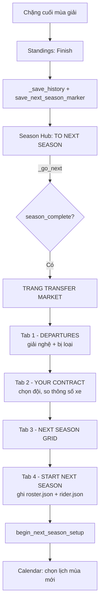

# Transfer Market — Thiết kế

> **Trạng thái: bản thiết kế, chưa code.** File này ghi lại flow và các quyết định
> đã chốt để đọc lại trước khi bắt tay vào làm.

Kỳ chuyển nhượng (*silly season*) diễn ra **giữa hai mùa giải** trong Career mode:
tay đua giải nghệ, tân binh xuất hiện, đội hình 12 đội xáo trộn, và người chơi
nhận offer hợp đồng — hoặc bị đội sa thải.

## Phạm vi

| Có làm | Không làm |
|---|---|
| Người chơi nhận offer và chọn đội | Chuyển nhượng giữa mùa (chỉ off-season) |
| Người chơi có thể bị sa thải | Đội mới / đội biến mất (12 đội cố định) |
| AI giải nghệ theo tuổi | Phát triển xe theo mùa (`bikes_rating.csv` giữ nguyên) |
| Gọi tân binh từ pool 100 người soạn sẵn | Lương / ngân sách / tiền |
| Hợp đồng 1–2 năm | Tin đồn, đàm phán nhiều vòng |
| Đổi đội ⇒ đổi luôn thông số xe | **Chỉ số AI đổi theo thời gian** — xem bên dưới |

**Không cần tương thích ngược.** Các slot trong `data/career/` hiện tại chỉ là
career test khi phát triển tính năng — thiết kế này nhắm vào các custom rider
tạo mới về sau.

## Bối cảnh kỹ thuật

Ba điều quyết định toàn bộ thiết kế:

1. **Roster hiện không hề được lưu.** `MotoWizard.__init__` gọi
   `load_riders(RAW)` đọc thẳng từ `data/raw/entry_info.csv` mỗi lần khởi động
   (`app/wizard.py:79`). Tay đua của người chơi chỉ là hàng thứ 25 nối vào bằng
   `pd.concat`. Sau chuyển nhượng, đội hình không còn khớp CSV nữa → **bắt buộc
   phải có roster bền vững**. Đây là phần việc lớn nhất, không phải UI.

2. **Chỉ số xe tra theo `(manufacturer, team_status)`** từ `bikes_rating.csv`.
   Nên "đổi đội" tự động có nghĩa là "đổi xe" — chỉ cần tra lại bảng, không phải
   lưu gì thêm.

3. **Mọi đường vào mùa mới đều đi qua một phễu duy nhất:**
   `begin_next_season_setup()` (`app/wizard.py:375`) → `CalendarPage._enter_calendar()`
   (`app/pages/p_calendar.py:651`). Kỳ chuyển nhượng chèn vào ngay trước phễu này.

Ngoài ra: 12 đội × 2 tay đua (6 factory / 6 satellite), ảnh xe khoá cứng theo
**tên đội** trong `p_gallery._BIKE_IMAGE` — nên giữ nguyên 12 đội thì không cần
thêm asset nào cho tân binh (game không có ảnh chân dung tay đua).

## Mô hình dữ liệu

### Pool tân binh — `data/raw/riders_pool.csv`

100 tay đua soạn sẵn, **dùng chung cho mọi career** (nội dung tĩnh, giống 24 tay
đua gốc). Đây là nguồn thay thế cho những người giải nghệ — không sinh tên ngẫu
nhiên. Cột giống hệt `riders_rating.csv` (`braking`/`cornering` không prefix,
loader tự đổi thành `rider_*`), cộng thêm `age` và `nationality`.

Không có `bike_number` / `team` / `manufacturer` — những thứ đó chỉ được gán vào
lúc tay đua được gọi lên lưới.

**Chỉ số pool trải đúng dải của lưới hiện tại.** Đây là quyết định quan trọng
nhất của cả thiết kế, xem [Vì sao AI không tiến bộ](#vì-sao-ai-không-tiến-bộ):

| Trung bình 6 chỉ số | pool | lưới hiện tại |
|---|---|---|
| Thấp nhất | 75.7 | 78.2 |
| 25% | 82.0 | 81.5 |
| **Median** | **83.6** | **83.8** |
| 75% | 85.2 | 86.3 |
| Cao nhất | 90.3 | 91.0 |

Đuôi dưới của pool thấp hơn lưới một chút là cố ý — phải có tân binh thật sự
kém, vào lưới là chốt bảng. Còn median và đỉnh thì bám sát, để lưới giữ nguyên
tính cách qua hàng chục mùa.

Bốc ai là **ngẫu nhiên**. Bốc trúng Yassine Benjelloun (90.3) thì đội lên hương;
bốc phải Clement Faivre (75.7) thì chịu. Đội không có cách nào biết trước, và đó
là chủ ý — kỳ chuyển nhượng phải có may rủi.

### Roster của career — `data/career/slot{N}/roster.json`

```jsonc
{
  "year": 2027,          // roster này áp dụng CHO mùa nào — chốt idempotency
  "riders": [            // 24 tay đua AI, schema y hệt rider.json + 1 field mới
    {
      "name": "Javier Ruiz", "age": 29, "nationality": "Spain",
      "bike_number": 26, "manufacturer": "Ducati",
      "team": "Razor Racing", "team_status": "satellite",
      "rider_braking": 79, "rider_cornering": 83, "aggression": 99,
      "tyre_management": 93, "consistency": 99, "wet_performance": 93,
      "top_speed": 92, "acceleration": 86, "bike_braking": 86,
      "bike_cornering": 85, "stability": 85,
      "contract_until": 2028      // MỚI: còn hợp đồng thì không ra thị trường
    }
  ],
  "retired":   [ { "name": "...", "age": 37, "year": 2027 } ],  // hiển thị lịch sử
  "pool_used": ["Stefano Toselli", "Dani Recio"]   // đã gọi lên, không gọi lại
}
```

- **Được tạo khi career bắt đầu** (dựng từ CSV), nên luôn tồn tại. Slot không có
  file thì dựng từ CSV — cũng chính là đường tạo mới, nên miễn phí.
- `rider.json` **vẫn là nguồn chân lý** cho chỉ số tay đua người chơi (progression
  đã ghi vào đó). Roster chỉ quyết định **đội / hãng / status / chỉ số xe** của họ.
- `roster.year` khiến việc chạy thị trường **idempotent**: thoát app giữa chừng
  rồi vào lại **không** roll lại kỳ chuyển nhượng của năm đó.

## Flow



Điểm chèn: `SeasonHubPage._go_next` / `nextId()` route sang `ID_TRANSFERS` khi
`season_complete`; trang đó gọi `begin_next_season_setup()` sau khi người chơi ký.
Championship mode không có roster nên vẫn đi thẳng vào lịch như cũ.

### Đường vào thứ hai: khởi động lại app

Kết thúc mùa xong, `save_next_season_marker()` ghi đè season save bằng
`{season_complete: True, year: Y+1}`. Nếu người chơi tắt app ngay lúc đó, lần mở
sau `CalendarPage._resume_season` thấy marker và **nhảy thẳng vào chọn lịch** —
bỏ qua kỳ chuyển nhượng.

Xử lý: `_resume_season` kiểm tra `wiz.transfers_done_for(year)`. Chưa chạy thì
đưa người chơi về **Season Hub ở trạng thái "TO NEXT SEASON"** — đúng chỗ họ vừa
rời đi — rồi luồng bình thường lại đi qua trang chuyển nhượng.

**Bất biến chống chạy hai lần:** thị trường đã chạy cho năm `Y` ⟺ `roster.year ≥ Y`.
`TransfersPage` dập mốc đó ngay khi người chơi ký, và không gì khác động vào nó.
Vào lại trang khi đã ký thì nó tự bỏ qua, đi thẳng sang lịch.

> Trước lúc ký thì **không ghi gì ra disk**. Thoát giữa chừng nghĩa là lần sau
> roll lại một kỳ chuyển nhượng khác — không để lại career dở dang.

### Thứ tự xử lý trong engine

```
1. Tăng tuổi toàn bộ roster +1          (chỉ số KHÔNG đổi — xem bên dưới)
2. Tính HIỆU QUẢ mùa vừa rồi cho mọi tay đua
       = thứ hạng kỳ vọng của xe − thứ hạng thực tế
3. Roll giải nghệ → ghế trống
4. Trừ hạn hợp đồng (còn hạn thì miễn nhiễm ở bước 5)
5. Xét không-đạt-kỳ-vọng trên số hết hạn hợp đồng:
       hiệu quả ≤ −3.0  VÀ  thua đồng đội
       → factory: bị loại, RỜI HẲN GIẢI (không xuống satellite)
       → người chơi: bị sa thải, ra thị trường
6. Duyệt đội theo POWER GIẢM DẦN, xử lý hàng đợi ghế trống:
       factory   → thử promote satellite cùng hãng (ngưỡng chênh 3.0)
                   → chiêu mộ ngoài (ngưỡng theo power)
                   → bốc tân binh
       satellite → bốc tân binh / chiêu mộ từ hãng khác
       ghế mới thủng do promote → đẩy vào cuối hàng đợi
7. Tạo offer cho người chơi từ các ghế còn trống
8. Người chơi chọn → chốt đội hình → tra lại chỉ số xe
```

Người chơi chọn **sau cùng** (bước 8) nên offer luôn là ghế có thật, không bị
AI cướp mất sau khi đã hiện lên màn hình.

Bước 5 chỉ xét người **hết hạn hợp đồng** — đó là cái phanh giữ cho lưới không bị
thay máu ồ ạt mỗi mùa (xem *Ngân sách churn* bên dưới).

## Luật engine

### Vì sao AI không tiến bộ

**Chỉ số của tay đua AI không bao giờ thay đổi.** Họ chỉ già đi rồi giải nghệ.
Không có đường cong tuổi, không có trần tiềm năng, không có hệ tiến bộ nào cả.

Nghe như lười, nhưng đây là kết luận rút ra từ dữ liệu thật của career slot0
(Stefan Brugmans, 10 mùa đã đua) — và nó ngược với trực giác ban đầu.

**Người chơi không hề áp đảo.** Dựng lại từ chính kết quả đua của Stefan:

| Năm | 1 | 2 | 5 | 10 | 15 | 20 | 25 |
|---|---|---|---|---|---|---|---|
| Chỉ số | 67.1 | 73.1 | **82.5** | 84.6 | 86.6 | 88.1 | 89.2 |

Toàn bộ tăng trưởng nằm ở **5 năm đầu** (+22.5 điểm). Từ năm 6 trở đi `W1 = 0`
trong công thức XP (`src/progression.py`) nên mỗi mùa chỉ còn +0.3 đến +0.6.
`test_formula.py` tune trên `YEARS = 15`, tức là mốc ~86 sau 15 năm là **cố ý**.
Stefan hiện 84.94 sau 10 mùa — khớp gần như tuyệt đối. Hạng cao nhất anh ta từng
đạt: **P15**.

Vậy rủi ro không phải "bảo vệ lưới khỏi người chơi" mà là **giữ lưới đừng tụt
xuống dưới người chơi**. Mô phỏng 20 mùa cho ba phương án:

| Mùa 20 | Bạn | median lưới | mạnh nhất | Kết quả |
|---|---|---|---|---|
| Có potential + đường cong tuổi | 88.1 | 76.3 | 87.5 | Bạn thành số 1 — vỡ cân bằng |
| Đóng băng, giữ pool 70–76 | 88.1 | 73.2 | 75.3 | Hơn cả lưới 13 điểm, vô nghĩa |
| **Đóng băng + kéo giãn pool** | 88.1 | **81.7** | **88.0** | **Vừa kịp tranh vô địch** |

Hai phương án đầu đều **phá phần cân bằng đã tune sẵn** trong `test_formula.py`:
chúng làm lưới yếu đi, nên người chơi mạnh lên một cách tương đối mà không cần
giỏi hơn. Phương án thứ ba giữ lưới đứng yên nên quan hệ giữa người chơi và đối
thủ đúng như thiết kế gốc.

**Kiểm chứng** — 30 lần chạy × 25 mùa với pool đã kéo giãn:

| Mùa | Bạn | median lưới | mạnh nhất | Số người ≥ 88 | Tuổi TB | Pool đã dùng |
|---|---|---|---|---|---|---|
| 1 | 67.1 | 83.8 | 91.0 | 2.0 | 26.6 | 0/100 |
| 5 | 82.5 | 83.8 | 90.1 | 1.4 | 27.9 | 5/100 |
| 10 | 84.6 | 83.2 | 88.3 | 1.3 | 27.2 | 16/100 |
| 15 | 86.6 | 83.5 | 88.6 | 2.1 | 27.4 | 25/100 |
| 20 | 88.1 | 83.6 | 89.0 | 2.5 | 27.7 | 34/100 |
| 25 | 89.2 | 83.8 | 88.9 | 2.4 | 27.2 | 44/100 |

Median lưới dao động **82.0 – 85.2** qua toàn bộ 750 mùa mô phỏng (gốc: 83.8).
Luôn có 1–3 tay đua ≥ 88 nên người chơi luôn có đối thủ thật. Tuổi trung bình
đứng yên ở ~27. Pool đủ cho **~55 mùa**.

Và đường cong career hiện ra đúng như một career mode nên có: **lẹt đẹt 5 năm
đầu → giữa bảng suốt một thập kỷ → mùa 20 mới ngang người mạnh nhất → mùa 25 mới
thực sự đứng đầu.**

> **Cái giá phải trả:** thế giới đứng yên. Tân binh 19 tuổi vào ở 88 thì 15 năm
> sau vẫn 88 — không có chuyện "thằng bé mình để ý năm ngoái giờ thành nhà vô
> địch". Chấp nhận được, vì game không có UI nào (scouting, giải trẻ) để người
> chơi kịp để ý chuyện đó: họ chỉ thấy trang chuyển nhượng mỗi năm một lần.

> **Nếu sau này muốn người chơi mạnh hơn**, cần gạt nằm ở `STAT_CAP` và đường
> cong XP trong `src/progression.py` — **không** nằm ở thị trường chuyển nhượng.
> Làm lưới yếu đi là cách sai để đạt điều đó.

### Giải nghệ

- Dưới 32 tuổi: không bao giờ.
- 32–37: xác suất tăng dần theo tuổi, **giảm** nếu chỉ số còn cao (tay đua giỏi
  trụ lâu hơn).
- 38: bắt buộc giải nghệ.

### Tân binh

Gọi từ `riders_pool.csv` — **không sinh ngẫu nhiên**. Mỗi người có tên, quốc
tịch, tuổi và chỉ số đã soạn sẵn; chỉ `bike_number` là gán lúc gọi lên (lấy số
còn trống).

Ai đã được gọi thì ghi vào `roster.json` để không bị gọi lại ở career đó. Thứ tự
gọi **ngẫu nhiên** trong số những người chưa dùng, nên mỗi career gặp một thế hệ
khác nhau — 100 người cho ~1.77 tân binh/mùa là đủ **~57 mùa**.

Tân binh nhận **số xe ngẫu nhiên trong 4–99**, lấy trong những số còn trống. Ngẫu
nhiên chứ không lấy số nhỏ nhất, nếu không cả loạt tân binh sẽ đeo #4, #5, #6.
Số xe của người giải nghệ hoặc rời giải **được trả lại kho** ngay mùa sau — riêng
người đang trong diện mất ghế thì vẫn giữ chỗ suốt kỳ chuyển nhượng, vì họ có thể
được ký tiếp ở dưới và không được trùng với tân binh vừa gọi lên.

Tuổi trong pool là **cố định**: ai ghi 19 tuổi thì ra mắt năm 19 tuổi, bất kể
được gọi ở mùa thứ mấy. Pool là hàng đợi tân binh, không phải giải trẻ được mô
phỏng song song.

Chỉ số họ mang vào lưới **là chỉ số vĩnh viễn** của họ — không tăng, không giảm.
Bốc trúng ai là chuyện may rủi thuần tuý.

### Sức mạnh xe & kỳ vọng của từng ghế

Mọi luật bên dưới đều quy về một con số: **`power` = trung bình 5 chỉ số xe**
trong `bikes_rating.csv`.

| # | Đội | Power | Điểm/mùa | | # | Đội | Power | Điểm/mùa |
|:-:|---|:-:|:-:|---|:-:|---|:-:|:-:|
| 1 | Ducati Factory Racing | 91.8 | 427 | | 7 | BMW Factory Racing | 83.6 | 119 |
| 2 | Suzuki Factory Racing | 89.2 | 318 | | 8 | Storm Riders | 81.4 | 76 |
| 3 | Kawasaki Factory Racing | 89.0 | 261 | | 9 | Inferno Factory | 80.0 | 28 |
| 4 | Razor Racing | 86.8 | 220 | | 10 | Falcon Racing | 78.6 | 27 |
| 5 | Yamaha Factory Racing | 86.4 | 219 | | 11 | Triumph Factory Racing | 77.2 | 10 |
| 6 | Honda Factory Racing | 85.0 | 115 | | 12 | Phoenix Motorsport | 72.2 | 1 |

Cột **Điểm/mùa** đo bằng **chính engine đua thật**: cho cả 24 tay đua bộ chỉ số y
hệt nhau rồi chạy 12 mùa × 13 chặng × 2 race, nên khác biệt còn lại thuần tuý do
chiếc xe (script: `scratchpad/bike_expected_points.py`).

Kết quả đáng chú ý: **chiếc xe quyết định gần như tất cả.** Cùng một tay đua,
Ducati Factory ăn 427 điểm còn Phoenix Motorsport được 1.2. Đối chiếu 10 mùa
thật trong slot0 thì khớp ở nhóm giữa và dưới (Triumph Factory: đo 19.8 — thật
19.1), và chỗ lệch chính là phần tay đua đóng góp.

### Đo hiệu quả — "vượt mặt chiếc xe bao nhiêu"

```
hiệu quả = thứ hạng kỳ vọng của xe − thứ hạng thực tế cuối mùa
```

Thứ hạng kỳ vọng suy ra từ bảng trên: đội xe mạnh nhất giữ ghế 1–2, đội thứ hai
giữ ghế 3–4, v.v. Số dương = vượt mặt chiếc xe mình đang có.

> **Vì sao không dùng phép chia `điểm thực / điểm kỳ vọng`:** mẫu số tiến về 0 ở
> đáy bảng. Phoenix Motorsport "đáng" 2.4 điểm/mùa nhưng thực tế được 50.3 → tỷ
> lệ 21.0×, trong khi Ducati ra 0.86×. Không so được. Thang thứ hạng thì có chặn
> trên chặn dưới nên tuyến tính ở mọi vị trí.

Kiểm chứng trên 10 mùa thật của slot0 — biên độ **−6.9 … +7.6**, lệch chuẩn 3.7:

| Tay đua | Đội | Hạng xe | Hạng thật | Hiệu quả |
|---|---|:-:|:-:|:-:|
| Lorenzo Russo | Yamaha Factory Racing | 9.5 | 1.9 | **+7.6** |
| Manuel Navarro | Falcon Racing *(BMW satellite)* | 19.5 | 12.3 | **+7.2** |
| Francesco Carelli | Phoenix Motorsport | 23.5 | 16.8 | **+6.7** |
| … | | | | |
| Daniel Vaquero | Kawasaki Factory Racing | 5.5 | 9.8 | −4.3 |
| Victor Burgos | Inferno Factory | 17.5 | 23.1 | −5.6 |
| Leon Schäfer | BMW Factory Racing | 11.5 | 18.4 | **−6.9** |

Thước đo này tự tìm ra đúng ca mẫu: **BMW Factory** ôm Leon Schäfer (−6.9, kém
nhất giải) trong khi đội em **Falcon Racing** có Manuel Navarro (+7.2, nhì giải).
Chênh 14.1 → promote, không phải bàn.

### Không đạt kỳ vọng → mất ghế

Một tay đua **ở đội factory** bị loại khi thoả **cả ba**:

1. **hết hạn hợp đồng** — cái phanh giữ nhịp thay máu
2. `hiệu quả ≤ −3.0` (≈ 0.8 lệch chuẩn — không đáng với chiếc xe đang có)
3. **thua đồng đội** (cùng xe nên đây là phép so công bằng tuyệt đối)

Điều kiện (2) một mình sẽ oan cho người chạy tốt trong đội yếu; điều kiện (3) một
mình thì đội nào cũng phải đuổi một người mỗi mùa, vì trong hai người luôn có một
người về sau.

> **Ghế satellite được miễn.** Chúng vốn đã trống ra đủ nhiều qua promote và giải
> nghệ. Khi mình áp luật này cho cả 24 ghế, nhịp thay máu vọt lên **3.0 tân
> binh/mùa** và pool cạn ở mùa 34. Giới hạn lại đúng ghế factory thì về **2.38** —
> khớp ước tính bên dưới, pool đủ 42 mùa.

> **Ngân sách churn.** Người rời hẳn giải (giải nghệ + factory bị loại) là số tân
> binh phải gọi từ pool. Pool 100 người nên:
>
> | Bị loại/mùa | Tân binh/mùa | Pool đủ cho |
> |:-:|:-:|:-:|
> | 0 | 1.5 | 67 mùa |
> | 1 | 2.5 | 40 mùa |
> | 2 | 3.5 | 29 mùa |
> | 3 | 4.5 | 22 mùa |
>
> Với ngưỡng −3.0 + phải thua đồng đội + hợp đồng bảo vệ ≈ **0.9 người bị loại/mùa**
> → tổng ~2.4 tân binh/mùa → **pool đủ ~41 mùa**. Nới ngưỡng là rút ngắn tuổi thọ
> pool; đó là ràng buộc phải nhớ khi tune.

### Luồng team factory

```
Ghế factory trống (giải nghệ HOẶC bị loại vì không đạt kỳ vọng)
  │
  ├─(1)─ Hãng có satellite team?   [Ducati↔Razor, Honda↔Inferno,
  │        │                        Yamaha↔Storm, BMW↔Falcon,
  │        │                        Triumph↔Phoenix]
  │        │      Suzuki và Kawasaki KHÔNG có → bỏ qua bước này
  │        │
  │        └─ Lấy A = người hiệu quả cao nhất ở satellite cùng hãng
  │             │
  │             ├─ ghế trống do BỊ LOẠI    → mốc so B = hiệu quả của chính người bị loại
  │             └─ ghế trống do GIẢI NGHỆ  → mốc so B = hiệu quả trung bình của ghế factory đó (≈ 0)
  │
  │           hiệu quả(A) − B  <  3.0  → chênh lệch không đáng, bỏ, sang (2)
  │           hiệu quả(A) − B  ≥  3.0  → PROMOTE A lên factory
  │                                       (ghế satellite của A thành trống → vào hàng đợi)
  │
  └─(2)─ Chiêu mộ ngoài / bốc tân binh
           • đòi hiệu quả tối thiểu, ngưỡng tỉ lệ thuận với power của đội
           • factory mạnh (Ducati, Suzuki, Kawasaki) đòi hiệu quả cao
           • factory yếu (Triumph, BMW) hạ ngưỡng → phải chịu lấy hàng thải
           • không ai đạt ngưỡng → bốc tân binh từ pool
```

Duyệt đội theo **thứ tự power giảm dần**, ghế mới thủng đưa vào cuối hàng đợi —
nên hiệu ứng dây chuyền (Ducati rút người từ Razor, Razor lại thủng) được xử lý
đúng thứ tự ưu tiên.

### Luồng team satellite

Đội satellite **không đi săn người của đội khác cùng hãng**. Họ lấp ghế bằng:

- **tân binh từ pool** (nguồn chính), hoặc
- **chiêu mộ tay đua từ hãng khác** — người tự do không được factory nào lấy

**Tay đua mất ghế factory thì tụt xuống đội yếu hơn, chứ không rời giải.**

Mỗi mùa MotoGP thật chỉ có hai ba tân binh thực thụ, không phải tám. Một tay đua
đã có hồ sơ thì hợp lý hơn nhiều so với việc giải đấu tự thay một phần tư đội
hình mỗi mùa đông. Nên thứ tự lấp ghế là:

```
promote satellite cùng hãng → chiêu mộ từ đội yếu hơn
    → NGƯỜI VỪA MẤT GHẾ → tân binh (cuối cùng)
```

Người mất ghế chỉ đi được xuống đội **yếu hơn** đội vừa thải họ (đó chính là sự
tụt hạng), và phải còn **đáng ký**:

```
độ hấp dẫn = chỉ số − 1.8 × (tuổi − 28, nếu dương)
ký được khi độ hấp dẫn ≥ 76
```

Tuổi không tính gì cho tới cuối tuổi 20 rồi cắn rất mạnh. Nên một người 26 tuổi
vừa có mùa tệ thì đáng đánh cược, còn người 35 tuổi cùng chỉ số thì không.
**Hiệu quả mùa vừa rồi cố ý không nằm trong công thức** — họ vừa bị loại đúng vì
cái đó, tính hai lần thì chẳng ai ký được nữa.

Đo được **75% ở lại**, và quan trọng hơn là *ai* ở lại:

| Tuổi | % ở lại |
|:-:|:-:|
| ≤ 29 | **97%** |
| 30–31 | 65–73% |
| 32 | 28% |
| ≥ 33 | **11%** |

Người ở lại trung bình 27.5 tuổi, người rời giải 32.0. Vài người 33+ vẫn trụ —
đó là các ca chỉ số còn đủ cao để bù tuổi. Tân binh giảm từ **2.38 xuống
1.85/mùa** (pool đủ 42 → **54 mùa**), tuổi trung bình lưới lên 27.1.

> Luật này **thay thế** quy tắc cũ "bị loại thì rời hẳn giải". Ngưỡng là cần gạt
> chỉnh tỉ lệ ở lại: hạ `SALVAGE_BAR` là giữ lại nhiều hơn (74 → 92%), nâng lên
> là ít hơn (82 → 28%).

> **"Đi lên" đo bằng chiếc xe, không phải bằng chức danh.** Razor Racing
> (satellite, power 86.8) là xe **tốt hơn** Honda Factory (85.0), BMW Factory
> (83.6) và Triumph Factory (77.2). Nên rời Triumph Factory sang Razor Racing là
> thăng tiến thật, và engine cho phép. Bất biến thực sự là: **không ai bị chuyển
> sang xe yếu hơn**, và **người đã bị loại không bao giờ quay lại lưới**. Cả hai
> đều được assert trong `test_transfers.py`.

### Bốc tân binh từ pool

Mỗi đội có ghế trống rút một **mục tiêu** từ phân phối chuẩn rồi lấy tân binh còn
lại **gần mục tiêu đó nhất**:

```
μ(đội)  = 83.4 + 1.5 × z(power)      z = (power − trung bình) / lệch chuẩn
target ~ N( μ(đội), σ = 3.0 )
```

`83.4` là chỉ số trung bình của pool. Đội xe mạnh nhất nhắm **85.6**, yếu nhất
nhắm **80.5** — cao hơn "một chút" đúng như thiết kế, không phải vợt sạch hàng
ngon. Hiệu chỉnh trên 500 lần bốc mỗi mức:

| SHIFT | σ | Tương quan xe↔người |
|:-:|:-:|:-:|
| 1.5 | 2.0 | 0.58 |
| **1.5** | **3.0** | **0.43** |
| 1.5 | 4.5 | 0.32 |
| 2.5 | 3.0 | 0.64 |
| 3.5 | 3.0 | 0.76 |

Chọn **SHIFT = 1.5, σ = 3.0** → tương quan **0.43**. Xe mạnh thường có người
giỏi, nhưng người giỏi nhất lưới vẫn hay ngồi xe hạng 3–4 — đúng tính cách lưới
soạn tay (Javier Ruiz 91.0 trên Razor Racing, xe hạng 4; tương quan gốc 0.007).
Từ 0.7 trở lên thì chức vô địch được quyết ở kỳ chuyển nhượng chứ không phải trên
đường đua.

> **Median lưới không đổi dù SHIFT bao nhiêu.** Bốc lệch chỉ đổi *ai ngồi xe nào*,
> không đổi *tập hợp tay đua trên lưới* — nên phần kiểm chứng cân bằng ở
> [Vì sao AI không tiến bộ](#vì-sao-ai-không-tiến-bộ) vẫn nguyên giá trị.
>
> Điều đó **chỉ đúng khi số tân binh gọi lên bằng đúng số ghế trống**. Nếu có lúc
> nào gọi dư rồi loại bớt theo chỉ số, hàng ngon sẽ bị hút cạn ở các mùa đầu và
> lưới tụt dần — đúng thất bại mà cả thiết kế này đang tránh.

### Người chơi

Người chơi chịu **đúng luật như AI** — cùng thước đo hiệu quả, cùng ngưỡng. Khác
biệt duy nhất: đến bước 7 họ được *chọn* thay vì bị gán.

> ⚠ **Người chơi là suất dôi ra, không chiếm ghế AI.** Lưới thật có **25 tay
> đua**: 24 AI trong 12 đội hai ghế, cộng người chơi làm người thứ 25 (đội của
> họ chạy ba xe — game vẫn luôn như vậy, kiểm chứng trong slot0). Nên bước 7
> **không phải** "offer từ các ghế còn trống" như bản thiết kế đầu viết — AI lấp
> kín 24 ghế thì chẳng còn ghế nào. Thực tế là **"những đội muốn bạn"**: mọi đội
> mà hiệu quả của người chơi vượt ngưỡng tuyển của đội đó.

Họ luôn khởi nghiệp ở một đội **satellite** (`p_career._confirm_new_rider`), nên
tự động là ứng viên promote cho đội factory cùng hãng — đó là nấc thang đầu tiên
của sự nghiệp:

- **Được promote**: nếu là người hiệu quả cao nhất ở satellite của hãng, và chênh
  với mốc factory ≥ 3.0 → đội factory cùng hãng gửi offer.
- **Bị sa thải**: hết hạn hợp đồng + `hiệu quả ≤ −3.0` + thua đồng đội → mất ghế.
  (Nếu lúc đó đang ở factory thì luật "không xuống satellite" **không** áp dụng
  cho người chơi — họ vẫn được nhận offer từ satellite, vì bắt người chơi giải
  nghệ ngoài ý muốn là kết thúc luôn career.)
- **Offer**: mọi đội mà hiệu quả người chơi đạt ngưỡng tuyển của đội đó. Ngưỡng
  tỉ lệ thuận với sức mạnh xe, nên xe càng xin càng khó vào.
- **Không đội nào muốn** → vẫn luôn có **ít nhất một offer từ đội yếu nhất giải**
  (Phoenix Motorsport). Không để career kết thúc ngoài ý muốn: game không có
  luồng nào cho chuyện đó, và một mùa tệ thì không đáng bị xoá sổ. Rơi xuống
  chiếc xe tệ nhất lưới đã là hình phạt đủ nặng, mà vẫn còn đường leo lại.

## Giả định đã chốt

1. **Hợp đồng 1–2 năm.** Tay đua còn hạn không ra thị trường **và không bị loại
   vì thành tích** — đây là cái phanh giữ nhịp thay máu ở mức pool chịu được.
2. **Số xe giữ nguyên khi đổi đội**, chỉ đổi khi trùng.
3. **12 đội cố định** (7 factory + 5 satellite), mỗi đội đúng 2 ghế, luôn đủ 24
   tay đua AI. Suzuki và Kawasaki là factory không có đội em.
4. **Dòng chảy một chiều**: satellite → factory. Tay đua factory bị loại rời hẳn
   giải chứ không xuống satellite.

## Kế hoạch triển khai

| GĐ | Nội dung | File |
|---|---|---|
| 0 ✅ | Pool 100 tân binh, chỉ số kéo giãn về dải của lưới | `data/raw/riders_pool.csv` |
| 1 ✅ | Roster bền vững: `roster_path/build_initial_roster/load_roster/save_roster/clear_roster/ensure_roster/apply_roster_to_df` | `app/wizard.py`, `p_career.py` |
| 2 ✅ | Engine thuần (không Qt, test được) | `src/transfers.py` **(mới)** |
| 3 ✅ | Trang UI 4 tab, điều khiển bàn phím | `app/pages/p_transfers.py` **(mới)** |
| 4 ✅ | Nối vào luồng off-season | `p_season_hub.py`, `p_calendar.py`, `wizard.py` |
| 5 ✅ | Test bất biến qua nhiều mùa | `test_transfers.py` **(mới)** |

Ước lượng ~1200 dòng, phần lớn ở GĐ 3 (UI). Bỏ hệ tiến bộ AI làm GĐ 2 nhẹ đi
đáng kể — engine chỉ còn giải nghệ, gọi tân binh và ghép cặp.

### GĐ 5 kiểm tra gì

Chạy 25 mùa × nhiều seed rồi assert:

- luôn đúng 24 tay đua AI, mỗi đội đúng 2
- không trùng số xe
- **chỉ số không ai đổi qua các mùa** (bất biến cốt lõi của phương án này)
- median lưới bám trong khoảng **82–85** qua mọi mùa
- luôn có ít nhất 1 tay đua ≥ 88 trên lưới — nghĩa là có đối thủ thật
- tuổi trung bình lưới ổn định quanh 27, không già hoá hay trẻ hoá toàn bộ
- tương quan xe↔người giữ quanh **0.43** (không trôi lên 0.7+ qua các mùa, vì đó
  là lúc chức vô địch bị quyết ở kỳ chuyển nhượng)
- **số tân binh gọi lên đúng bằng số ghế trống**, không bao giờ dư
- **~2.4 tân binh/mùa**, pool không cạn trước mùa thứ 40
- **không ai đi từ factory xuống satellite** — dòng chảy chỉ một chiều đi lên
- mỗi hãng có satellite thì factory phải *thử* promote trước khi tìm ngoài

Chạy `python test_transfers.py`. Bảng xếp hạng được dựng bằng
`engine.perf_score_race` cộng nhiễu phong độ thay vì đua thật từng vòng — cùng
công thức chấm điểm mà Race session dùng, nhưng đủ nhanh để chạy 40 career × 25
mùa thay vì trả 11 giây mỗi mùa.

**Kết quả hiện tại — 35.772 bất biến + 8 cân bằng + 14 người chơi, không lỗi:**

| | Đo được | Mục tiêu |
|---|:-:|:-:|
| Median lưới | **82.4** (biên 80.5–85.0) | 82–85 |
| Mạnh nhất lưới | **88.7** | ≥ 88 |
| Mùa không có ai ≥ 86 | **< 5%** | < 5% |
| Tuổi trung bình | **27.1** | 25–29 |
| Tương quan xe↔người | **0.33** | 0.25–0.60 |
| Mất ghế/mùa | **1.24** — 75% tụt xuống đội yếu | 70–80% ở lại |
| Tuổi người ở lại / rời giải | **27.5 / 32.0** | chênh ≥ 3 |
| Dưới 30 ở lại / từ 33 ở lại | **97% / 11%** | ≥ 90% / ≤ 25% |
| Tân binh/mùa | **1.85** → pool đủ 54 mùa | ≤ 2.2 |

## Rủi ro

- **Cân bằng** — đã kiểm chứng bằng mô phỏng nên rủi ro thấp hơn nhiều so với
  phương án có hệ tiến bộ. Chỗ còn hở duy nhất: **trộn lẫn bước gọi tân binh với
  bước ghép cặp**. Ghép cặp có trọng số thì vô hại (median lưới không đổi), nhưng
  nếu trọng số đó lỡ áp cả vào việc chọn ai từ pool thì lưới sẽ tụt dần qua các
  mùa. Hai bước phải tách bạch trong code, và GĐ 5 phải assert được điều đó.
- **`_base_rider_count`** (`app/wizard.py:80`) hiện có nghĩa là "24 hàng đầu của
  df" và nhiều chỗ dựa vào nó (`reset_roster_to_base`, `p_career.py:936`). Phải
  chuyển sang khái niệm "roster AI" cho đúng, nếu không tay đua người chơi sẽ bị
  cắt nhầm.
- **Không đụng vào `data/career/slot*/`** khi test — dùng slot trống hoặc bản sao
  ở thư mục tạm.
